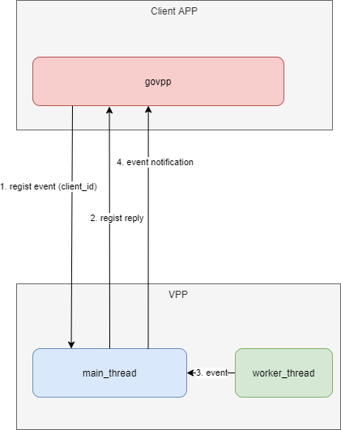

# How to add a event in VPP plugin
Note: this verify base on the VPP version 20.05

In this document, we will talk about adding event notification in VPP, and use the govpp client to interaction with it.

In Vpp, thers are 3 types of message exchanges:


	* Request/Reply
	The client sends a request message and the server replies with a
	single reply message. The convention is that the reply message is
	named as method_name + \_reply.
	
	* Dump/Detail
	The client sends a "bulk" request message to the server, and the
	server replies with a set of detail messages. These messages may be of
	different type. A dump/detail call must be enclosed in a control ping
	block (Otherwise the client will not know the end of the bulk
	transmission). The method name must end with method + "\_dump", the
	reply message should be named method + "\_details". The exception here
	is for the methods that return multiple message types
	(e.g. sw_interface_dump). The Dump/Detail methods are typically used
	for acquiring bulk information, like the complete FIB table.
	
	* Events
	The client can register for getting asynchronous notifications from
	the server. This is useful for getting interface state changes, and so
	on. The method name for requesting notifications is conventionally
	prefixed with "want_". E.g. "want_interface_events". Which
	notification types results from an event registration is defined in
	the service definition.


Anyting we mentioned here is in the scope of VPP binary API, VPP is the Server, 
and provide many services.

	### Services
	The service statement defines the relationship between messages.
	For request/response and dump/details messages it ties the
	request with the reply. For events, it specifies which events
	that can be received for a given want_* call.
	
	Example:
	```
	service {
	  rpc want_interface_events returns want_interface_events_reply
	    events sw_interface_event;
	};
	
	```
	

<div align=center> </div>
<center> <font color=red size=21>Figure1 Interactions for event notification </font></center>

<div align=center></div>
<center>Figure 2 Sequence for event notification</center>

For example, we will add a GTPU error indication event, 
this event is reported by VPP, and the APP client will do some post handling.

Code introduction:

	
	.
	|-- govpp
	|   |-- simple_client
	|   |-- simple_client.go
	|   `-- testgovpp.api.json
	|-- LICENSE
	|-- README.md
	|-- resources
	|   |-- eventsequence.png
	|   |-- eventworkflow.png
	|   `-- VPP.drawio
	`-- vpp2005
	    |-- api_helper_macros.h
	    `-- testgovpp
	        |-- CMakeLists.txt
	        |-- node.c
	        |-- setup.pg
	        |-- testgovpp.api
	        |-- testgovpp.c
	        |-- testgovpp.h
	        |-- testgovpp_periodic.c
	        `-- testgovpp_test.c
	

* folder govpp is for the go client code, it regist an event to VPP.
* folder resources is for the diagrams.
* vpp2005 is the code changes in VPP, and **testgovpp** is the added plugin. 

Here is the steps:

## 1 Add rpc service for cu_up_gtp_error_ind_events in the testgovpp.api, define the event msg struct, and the want*** struct.

	service {
	    rpc want_cu_up_gtp_error_ind_events returns want_cu_up_gtp_error_ind_events_reply events cu_up_gtp_error_ind_event;
	};

	define cu_up_gtp_error_ind_event {
	    u32 client_index;
	    u32 pid;
	    vl_api_cu_up_event_type_t type;
	    vl_api_cu_up_gtp_error_ind_t data;
	    u8 raw_msg_len;
	    u8 raw_msg_data[raw_msg_len];
	};
	
	autoreply define want_cu_up_gtp_error_ind_events {
	    u32 client_index;
	    u32 context;
	    bool enable_disable;
	    u32 pid;
	};


## 2 Add a handler for the registration in testgovpp.c
	
	//pub_sub_handler(cu_up_gtp_error_ind_events,CU_UP_GTP_ERROR_IND_EVENTS)
	static void vl_api_want_cu_up_gtp_error_ind_events_t_handler (                             
	    vl_api_want_cu_up_gtp_error_ind_events_t *mp) {

    	****

    }     
In api_helper_macros.h, it defines a MACRO function for pub_sub_handler, we will not use this template. Further more, we will add some specific handle in the want_xxx_handler.

In the handler function, it save the client_index to vpe_api_main's xxx_registration_hash table.

For the new registration_hash table, we need to add it to api_helper_macros.h. This is the only point which the VPP original code will be changed.

	diff --git a/src/vlibapi/api_helper_macros.h b/src/vlibapi/api_helper_macros.h
	index b19d4f90f..1a5071106 100644
	--- a/src/vlibapi/api_helper_macros.h
	+++ b/src/vlibapi/api_helper_macros.h
	@@ -285,7 +285,8 @@ _(bfd_events)                                   \
	_(l2_arp_term_events)                           \
	_(ip6_ra_events)                                \
	_(dhcp6_pd_reply_events)                        \
	-_(dhcp6_reply_events)
	+_(dhcp6_reply_events)                           \
	+_(cu_up_gtp_error_ind_events)

## 3 Send the event to client

Refer to function send_cu_up_gtp_error_ind_event().

Some key points:

  * The _vl_msg_id  must be filled, and the testgovpp_main.msg_id_base should be added.
  * Use the vl_api_send_msg() to send this event to registered clients.
  * Since we defined a slice **raw_msg_data** in the event struct, and it's length is variable. When allocate the message memory, this additional length must be included as below:
  * 
		vl_api_cu_up_gtp_error_ind_event_t *mp;
		int msg_size;
		
		msg_size = sizeof(*mp);
		msg_size += raw_msg_len;
		
		mp=vl_msg_api_alloc(msg_size);
		clib_memset(mp,0,msg_size);
		mp->_vl_msg_id = ntohs(VL_API_CU_UP_GTP_ERROR_IND_EVENT + testgovpp_main.msg_id_base);
		
		mp->client_index = reg->client_index;

## 4 Use govpp as the client API

The GoVPP projects provides the API for communication with VPP from Go.

Notes: 

1. about the api.json, this file is auto generated during building of VPP. Just need copy the vpp/api/ folder to /usr/share/vpp/api/, and use this command to generate the golang header files.

      ``` ./bin/binapi-generator --output-dir=./binapi  ```

2. use go module and vendor to build with the govpp.
